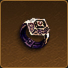
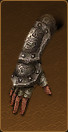
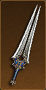
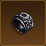
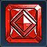
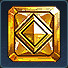
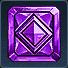
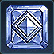
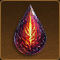
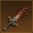

<h1 style="text-align: center;">Diablo III - Reaper of Souls Cheat Sheet (PC)</h1>

# Tips

- Start every season by doing the [Challenge Rift game mode](https://us.diablo3.blizzard.com/en-us/blog/21353255/welcome-to-challenge-rifts-12-18-2017) first as this gives you a lot of starting gold and materials.
- The maximum number of Blood Shards you can hold is determined by the highest solo Greater Rift you've completed.
- Enable Elective Mode in the option: `Options > Gameplay > Interface > Elective Mode`.
- My personal recommended seasonal starter class: Demon Hunter. Because she is fast, has good clear, can use a 6-set all the way into endgame and can use a second crafted set Guardian's Jeopardy ([belt](https://us.diablo3.blizzard.com/en-us/artisan/blacksmith/recipe/guardians-case) + [bracers](https://us.diablo3.blizzard.com/en-us/artisan/blacksmith/recipe/guardians-aversion)) when going [GoD Hungering Arrow](https://maxroll.gg/d3/guides/god-ha-demon-hunter-guide) build. A fast DH build is also useful for conquests.
- Torment XIII (T13) is often considered a magical difficulty number for loot due to its optimal balance between difficulty and loot rewards. Attempt to farm items like the  [Ring of Royal Grandeur](https://us.diablo3.blizzard.com/en-us/item/ring-of-royal-grandeur-Unique_Ring_107_x1) on at least T13.
- Socketed a ruby into your helm while levelling to 70 for bonus experience, even better if you obtain a [Leoric's Crown](https://us.diablo3.blizzard.com/en-us/item/leorics-crown-Unique_Helm_002_p1) (even if it's a low level crown).
- You can craft a level 70 weapon with a reduced level requirement mod (reroll it at the enchantress) for easy levelling past level 40 or if available (currently season-only) use the [Altar](https://diablo.fandom.com/wiki/Altar_of_Rites) to reduce the level requirement of all items down to level 1.
- Use [Ramaladni's Gift](https://diablo.fandom.com/wiki/Ramaladni%27s_Gift) on your best weapons instead of (re)rolling a socket. This essentially adds a free mod to your weapon.
- PC only: click and hold the left mouse button to quickly rearrange abilities on your skill bar near the bottom of the screen.
- After entering a new area/portal you will be immune to everything for 30 seconds. You can refresh this when by quickly leaving and re-entering.
- Sockets in helms and weapons (after levelling) are somewhat mandatory.
- You cannot change your starting act in adventure mode.
- You cannot obtain [Haedrig's gift](https://diablo.fandom.com/wiki/Haedrig%27s_Gift) in both softcore and hardcore, you can obtain it once per season per account regardless of where you obtain it.
- [Stone Gauntlets](https://us.diablo3.blizzard.com/en-us/item/stone-gauntlets-P66_Unique_Gloves_007) have no more downside if you take the altar `Omen` (Gain immunity to crowd-controlling effects).
- Legacy of Dreams can be obtained in low-level Greater Rifts, with keys farmable in low-level rifts and visions, and while the damage bonus won't appear on your character sheet, it also boosts your pets' damage, making it useful for solo or SSFHC players stuck without set items, [Haedrig's gift](https://diablo.fandom.com/wiki/Haedrig%27s_Gift) or friends.
- After reaching level 70, every Legendary or Set item you acquire from any source (drops, chests, gambling, crafting, or Cube recipes) has a 10% chance to be ancient and a 0.25% chance (meaning 1 on 400) to be Primal.
- Ancient items have a yellow border. Ancient primal items have a red border and have also a red border in the inventory screen and show a red beam when on the floor along with a red pentagram on the minimap.

# External links

- [Build guides](https://maxroll.gg/d3/category/guides) and more [build guides](https://www.icy-veins.com/d3/)
- [Character planner](https://maxroll.gg/d3/d3planner)
- [Difficulty overview](https://d3resource.com/difficulties/index.php)
- [Journey Tracker](https://d3resource.com/journey/index.php)
- [Official item database](https://us.diablo3.blizzard.com/en-us/item/)
- [Seasons overview](https://d3resource.com/seasons/index.php)

# Shortcuts (PC)

| Shortcut | Effect                         |
| -------- | ------------------------------ |
| ALT + Z  | Hide user interface            |
| B        | Place Banner                   |
| L        | Open Season Journey            |
| N        | Open clan page                 |
| P        | Open Paragon skill points menu |
| S        | Open skills menu               |
| T        | Use Town Portal                |

# Greater Rifts

## Blood Shards

| Greater Rift Level |  0  | 10  | 20  | 30  | 40  | 50  | 60  | 70  | 80  | 90  | 100 | 110 | 115 | 120 | 125 | 130 | 140 | 150 | 160 |
| ------------------- | --- | --- | --- | --- | --- | --- | --- | --- | --- | --- | --- | --- | --- | --- | --- | --- | --- | --- | --- |
| **Blood Shard Capacity** | 500 | 600 | 700 | 800 | 900 | 1000| 1100| 1200| 1300| 1400| 1500| 1600| 1650| 1700| 1750| 1800| 1900| 2000 | 2100 |

## Gem upgrades

**TLDR:** Minimum GR level for 100% upgrade chance (empowered and w/o dying): Gem level + 15.

| GR tier compared to Gem rank | -16 or lower | -6 to -15 | -5   | -4   | -3   | -2   | -1   | +6 to +0 | +7   | +8   | +9   | +10 or higher |
| ---------------------------- | ------------ | --------- | ---- | ---- | ---- | ---- | ---- | -------- | ---- | ---- | ---- | ------------- |
| Upgrade chance               | 0%           | 1%        | 2%   | 4%   | 8%   | 15%  | 30%  | 60%      | 70%  | 80%  | 90%  | 100%          |

For non-empowered rifts, run a Greater Rift 10 levels above your gem's level (if you can handle that) plus the number of upgrades you want. Example: your gem is level 55 and you want to upgrade it to level 59: use a GR level 69 to guarantee a 100% upgrade chance for all upgrades.

# Recommended general follower gear

## Best overall follower

- Softcore: Enchantress because she enhances your damage and provides strong crowd control and cooldown reduction.
- Hardcore: Templar because he can shield you from all damage for 5 seconds.

## Recommended gear

- [Avarice Band](https://us.diablo3.blizzard.com/en-us/item/avarice-band-Unique_Ring_108_x1) (totally not important to have)
- [Broken Crown](https://us.diablo3.blizzard.com/en-us/item/broken-crown-P2_Unique_Helm_001) with socketed non-unique gem of your choice
- [Enchanting Favor](https://us.diablo3.blizzard.com/en-us/item/enchanting-favor-x1_FollowerItem_Templar_Legendary_01) or [Skeleton Key](https://us.diablo3.blizzard.com/en-us/item/skeleton-key-x1_FollowerItem_Scoundrel_Legendary_01) or [Smoking Thurible](https://us.diablo3.blizzard.com/en-us/item/smoking-thurible-x1_FollowerItem_Enchantress_Legendary_01)
- [Goldskin](https://us.diablo3.blizzard.com/en-us/item/goldskin-Unique_Chest_001_x1) (not very important)
- [Gloves of Worship](https://us.diablo3.blizzard.com/en-us/item/gloves-of-worship-Unique_Gloves_103_x1) (these only drop from act II and act IV bounty caches)
- [Homing Pads](http://us.diablo3.blizzard.com/en-us/item/homing-pads-Unique_Shoulder_001_x1)
- [Krede's Flame](https://us.diablo3.blizzard.com/en-us/item/kredes-flame-Unique_Ring_003_x1) (totally not important to have)
- [Nemesis Bracers](https://us.diablo3.blizzard.com/en-us/item/nemesis-bracers-Unique_Bracer_106_x1)
- [Spaulders of Zakara](https://us.diablo3.blizzard.com/en-us/item/spaulders-of-zakara-Unique_Shoulder_102_x1)
- [ThunderFury](https://us.diablo3.blizzard.com/en-us/item/thunderfury-blessed-blade-of-the-windseeker-Unique_Sword_1H_101_x1) combined with [Wyrdward](https://us.diablo3.blizzard.com/en-us/item/wyrdward-Unique_Ring_102_p2) can stun enemies
- [The Flavor of Time](https://us.diablo3.blizzard.com/en-us/item/the-flavor-of-time-P66_Unique_Amulet_001) or [The Ess of Johan](https://us.diablo3.blizzard.com/en-us/item/the-ess-of-johan-Unique_Amulet_104_x1) (Ess of Johan is build specific)

*Note that  [Ring of Royal Grandeur](https://us.diablo3.blizzard.com/en-us/item/ring-of-royal-grandeur-Unique_Ring_107_x1) works on your follower and that your follower can equip set items.*

# Kanai's Cube Recipes (PC)

Is acquired by going to the `The Ruins of Sescheron` (act III, Adventure Mode only) and then entering `Elder Sanctum`. It's in a room close to the end of this area.

| Gem used in recipe | Corresponds to this attribute | Corresponds to this Essence |
|--------|--------------|------------------|
| Emerald (Green) | Dexterity    |Essence of Emerald|
| Ruby (Red) | Strength     |Essence  of Ruby|
| Topaz (Yellow) | Intelligence |Essence of Topaz|
| Amethyst (Purple) | Vitality  |Essence of Amethyst|
| Diamond (White) | <None> | Essence of Diamond  |

## 1. Extract Legendary Power

Extracts the legendary power from a legendary item, allowing you to equip it in Kanai's Cube without needing to equip the item itself. You can extract a power for your weapon, armor, and jewelry slots.

## 2. Reforge Legendary

Rerolls a legendary item as if it had just dropped, resetting its stats and potentially making it ancient (10% chance) or primal ancient (0.25% meaning 1 on 400).

## 3. Upgrade Rare Item

Converts a rare (yellow) item into a random legendary item of the same type. Useful for acquiring specific legendary items and/or set items and potentially making it ancient (10% chance) or primal ancient (0.25% meaning 1 on 400).

## 4. Convert Set Item

Converts a set item into a different piece from the same set, but it won’t reroll into the same type as the item you placed in the cube.

## 5. Remove Level Requirement

Removes the level requirement from the item.

## 6. Convert Gems

Converts 9 gems of one type into 9 gems of another type. The type is determined by the essence that you put into the Kanai Cube (sold by Squirt in Act II).

## 7. Convert Reusable Parts

Converts 100 [Reusable Parts](https://us.diablo3.blizzard.com/en-us/item/reusable-parts-Crafting_AssortedParts_01) into 100 of another material type based on the input: use a magic item to convert them into [Arcane Dust](https://us.diablo3.blizzard.com/en-us/item/arcane-dust-Crafting_Magic_01) or a rare item to convert them into [Veiled Crystals](https://us.diablo3.blizzard.com/en-us/item/veiled-crystal-Crafting_Rare_01).

## 8. Convert Arcane Dust

Converts 100 [Arcane Dust](https://us.diablo3.blizzard.com/en-us/item/arcane-dust-Crafting_Magic_01) into 100 of another material type based on the input: use a common item to convert them into [Reusable Parts](https://us.diablo3.blizzard.com/en-us/item/reusable-parts-Crafting_AssortedParts_01) or a rare item to convert them into [Veiled Crystals](https://us.diablo3.blizzard.com/en-us/item/veiled-crystal-Crafting_Rare_01).

## 9. Convert Veiled Crystals

Converts 100 [Veiled Crystals](https://us.diablo3.blizzard.com/en-us/item/veiled-crystal-Crafting_Rare_01) into 100 of another material type based on the input: use a common item to convert them into [Reusable Parts](https://us.diablo3.blizzard.com/en-us/item/reusable-parts-Crafting_AssortedParts_01) or a magic item to convert them into [Arcane Dust](https://us.diablo3.blizzard.com/en-us/item/arcane-dust-Crafting_Magic_01).

## 10. Augment Ancient (including Primal) Item

Augments an ancient or primal ancient item with additional stats based on the level of the legendary gem used (I recommend to only use level 125+ gems or a [Whisper of Atonement](https://us.diablo3.blizzard.com/en-us/item/whisper-of-atonement-P73_Unique_Gem_128)).

## 11. Upgrade Legendary Item

Upgrades the current item to a guaranteed Ancient Primal item, rerolling all of its stats and removes any augment on it. Works also on set items and you may only wear one of these per character so chose carefully. Unless there are stronger seasonal weapons, it's usually recommended to do this for your weapon. Primal amulets, chests, helmets, pants, rings always roll maximum amount of sockets. You can obtain 100 [Primordial Ashes](https://us.diablo3.blizzard.com/en-us/item/primordial-ashes-Crafting_Legendary_Primal_01) by salvaging 2 ancient primal items.

# Conquests (softcore)

---

##   Avarice

> Complete a 50,000,000 gold streak while outside of The Vault and The Inner Sanctum.

### Option 1

Collect 31 T16 bounty caches, dismiss your pet, go to town and open them at once (stand still while opening) and then quickly pick them all up.

### Option 2

Equip an [Avarice Band](https://us.diablo3.blizzard.com/en-us/item/avarice-band-Unique_Ring_108_x1) (drops from act III and act IV bounty caches) and a level 50 [Boon of the Hoarder](https://us.diablo3.blizzard.com/en-us/item/boon-of-the-hoarder-Unique_Gem_014_x1_PTR) gem and open a T16 [Not the Cow Level](https://diablo.fandom.com/wiki/Not_The_Cow_Level) by putting a [Bovine Bardiche](https://us.diablo3.blizzard.com/en-us/item/bovine-bardiche-Unique_Polearm_101_x1) into your Kanai cube. [Goldskin](https://us.diablo3.blizzard.com/en-us/item/goldskin-Unique_Chest_001_x1) and putting max points in the Paragon Gold Pickup Radius also helps.

---

##  Boss mode

> Kill the following bosses at max level (=usually character level 70) on Torment X or higher within 20 minutes of the start of the game.

| Act     | Bosses                                        |
| ------- | --------------------------------------------- |
| Act I   | The Skeleton King, The Butcher, Queen Araneae |
| Act II  | Maghda, Zoltun Kulle, Belial                  |
| Act III | Ghom, Cydea, Siegebreaker, Azmodan            |
| Act IV  | Rakanoth, Izual, Diablo                       |
| Act V   | Urzael, Adria, Malthael                       |

Note that everybody in your team who wants the conquest needs to participate in every single of those boss battles. It's 15 bosses in 20 minutes. Bring fast builds, play in a party and run every map together because only 1 person needs to locate the boss and the others can join instantly.

Clear act V first (=hardest act), if you can't do it in under 5 minutes then restart the game.

[Gloves of Worship](https://us.diablo3.blizzard.com/en-us/item/gloves-of-worship-Unique_Gloves_103_x1) (these only drop from act II and act IV bounty caches) can help out in case you hit a Speed Shrine.

---

##  Curses!

> Kill 350 or more monsters in a Cursed Chest event at level 70 on Torment X difficulty or higher.

Restart a private game repeatedly from Act 5 (using the minimum game difficulty required to complete it) and check the `Paths of the Drowned` for `The Cursed Peat` bounty (be prepared for it to take over a hundred attempts). When it appears, it will spawn a cursed chest with a favourable timer. Before attempting, invite 2-3 strong players to join your party.

---

##  Divinity

> Reach Greater Rift level 75 Solo.

This is basically a free conquest.

---

##  Masters of the Universe

> Master 8 set dungeons.

I recommend skipping this conquest but if not, I recommend doing it using 3 different classes (instead of 2) because some classes have set dungeons that are extremely hard. 5 pieces plus a  [Ring of Royal Grandeur](https://us.diablo3.blizzard.com/en-us/item/ring-of-royal-grandeur-Unique_Ring_107_x1) counts.

---

##  On a Good Day

> Level six Legendary Gems to level 65.

Just play Greater Rifts (between 3 to 5 gem levels per run) and you'll get them eventually.

---

##  Speed Demon

> Complete a Nephalem Rift at level 70 on Torment X or higher in under 2 minutes.

Play Demon Hunter or another fast clear build or ask someone to help you. Doing it with more people may help.

---

##  Sprinter

> Complete Acts I through V at level 70 in under 1 hour on any difficulty

I recommend skipping this conquest. However, if you choose to attempt it, make sure to do so with a full party where everyone has a fast build.

---

##  The Thrill

> Reach Greater Rift 45 Solo without any Set items equipped.

Equip a (at least somewhat levelled) [Legacy of Dreams](https://us.diablo3.blizzard.com/en-us/item/legacy-of-dreams-Unique_Gem_023_x1_PTR).

---

##  Years of War

> Reach Greater Rift 55 Solo while using the full bonus from six of the following Class Sets.

Is easy to do but it takes time to complete different 6 sets. 5 pieces plus a  [Ring of Royal Grandeur](https://us.diablo3.blizzard.com/en-us/item/ring-of-royal-grandeur-Unique_Ring_107_x1) counts.

---

# Staff of Herding

- May be required for upgrading your altar.
- All items and recipes are not guaranteed drops, higher game difficulties seem to have increased drop rates. Estimated drop rates are for T16.
- Item drops apply to a single player only, grouping up is not useful unless the other players already have those items.
- When you have all 5 items and the plan, craft it at the blacksmith.

## Plan: The Staff of Herding

Defeat Izual. Teleport to the `Silver Spire Level 1` > `The Great Span`. Est. drop chance: 10%.

## Wirt's Bell

Buy it from Squirt in Act II in the center of town, left of the enchantress for 100.000 gold.

## Gibbering Gemstone

Teleport to `The Bridge of Korsikk (act III)` and walk up and into `The Fields of Slaughter` and then find and enter the `Caverns of Frost (Level 2)`. You are looking for a [Unique Lacuni Huntress](https://diablo.fandom.com/wiki/Lacuni_Huntress), just fully clearing level 2 is the easiest (it may be hiding in a corner somewhere). Est. spawn rate: 5%.

## Leoric's Shinbone

`Leoric's Manor (act I)`. Teleport to `Leoric's Manor Courtyard`, walk inside the manor, go immediately right and check the fireplace.

## Black Mushroom

`Cathedral Level 1 (act I)`, spawns only in the room type as shown in the image below. Est. spawn rate: 30%.

## Liquid Rainbow

Restart the game until you encounter the `Dahlgur Oasis (Act II)` Bounty called `Clear the Mysterious Cave`. The estimated appearance chance of this bounty is around 3%. While the cave can also appear randomly without the bounty, it is generally found towards the bottom and slightly to the left of the waypoint (follow the wall). It is recommended to specifically search for the bounty instead. Once inside, explore both Level 1 and Level 2 of the cave for the `Mysterious Chest`. Although the chest doesn't have a guaranteed spawn, the chance is extremely high.

# Cheat Sheet Version
Version 1.3.0
